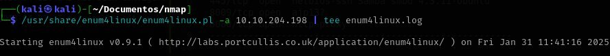

[THM](https://tryhackme.com/room/basicpentestingjt)
# [Basic Pentesting](https://tryhackme.com/room/basicpentestingjt) 
1. Para achar os recursos expostos da maquina:**NMAP**
  1. 

2. Achar os diretórios: **GoBuster**
  1. 
  Encontramos isso: 

3. Utilizando: **enum4linux**
  1. 

4. Utilizando o hydra para fazer o forcebrute: **Hydra**
  1. 
     Resultado:

5. Usando **SSH** vamos logar na maquina:
  

6. Para copiar o arquivo do **PEASS-ng**:
  1. scp <caminho do arquivo que você deseja enviar>(Downloads/...) <login para ssh>(jan@TARGET_IP)
  
  2. Executando 
    1. 
8. Conseguimos a senha rsa do usuário kay, utilizando para fazer login usando **JohnTheRipper** 
  1. Criei um arquivo com a senha:
     
  2. Porém o arquivo possui uma senha:
   

3. Então vamos usar o **JohnTheRipper**:
    1. Aqui utilizamos os ssh2john.py
    2. 
    3. 

       1. 
  4. Agora fazemos o login o usuário kay
    1. a passphrase = beeswax 
        